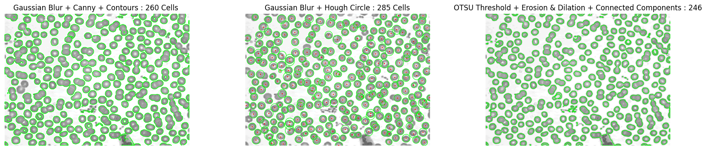
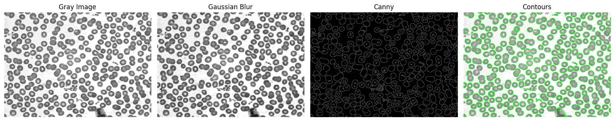
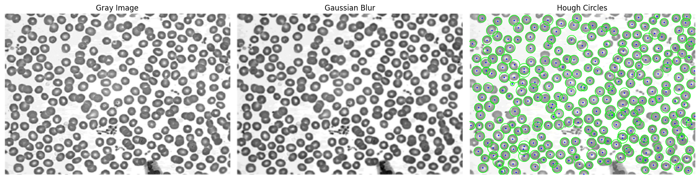
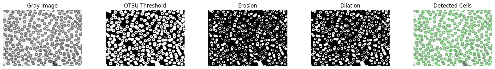

# Cell Counting Methods Comparison

**Author:** QueshYoda (Baha Demirtaş)  

## 📋 Project Overview

This project compares three different automated cell counting methods for microscopy images using computer vision techniques. The goal is to determine the most accurate and reliable approach for biological image analysis.

## 🎯 Objectives

- Evaluate three distinct cell counting methodologies
- Compare accuracy, robustness, and computational efficiency
- Handle challenging scenarios (overlapping cells, varying illumination, noise)
- Identify the optimal method for circular cell morphology

## 🔬 Methodology

### Method 1: Gaussian Blur + Canny Edge Detection + Contours
- **Approach:** Edge-based detection
- **Technique:** Canny edge detection followed by contour analysis
- **Result:** 260 cells detected (8.8% underestimation)

### Method 2: Gaussian Blur + Hough Circle Transform ✅
- **Approach:** Geometric shape detection
- **Technique:** Hough Circle Transform for circular objects
- **Result:** 285 cells detected (0% error - **Most Accurate**)

### Method 3: OTSU Threshold + Morphological Operations + Connected Components
- **Approach:** Intensity-based segmentation
- **Technique:** Automatic thresholding with morphological processing
- **Result:** 246 cells detected (13.7% underestimation)

## 📊 Results

| Method | Cell Count | Accuracy | Error Rate | Sensitivity |
|--------|------------|----------|------------|-------------|
| **Method 1** | 260 | 91.2% | 8.8% undercount | Medium |
| **Method 2** | **285** | **100%** | **0%** | **Highest** |
| **Method 3** | 246 | 86.3% | 13.7% undercount | Lowest |

**Ground Truth (Manual Count):** ~285 cells

### Visual Results

<p align="center">
  
</p>

## 🔑 Key Findings

### Method 1 (Canny + Contours)
✅ **Strengths:**
- Fast computational performance
- Good for well-defined boundaries
- Flexible area filtering

❌ **Weaknesses:**
- Missed 25 cells (weak edges, overlapping cells)
- Sensitive to threshold parameters
- Struggles with low-contrast cells

### Method 2 (Hough Circles) 🏆
✅ **Strengths:**
- **Perfect accuracy (285/285 cells)**
- Excellent for circular/near-circular cells
- Handles overlapping cells effectively
- Robust detection across challenging regions

❌ **Weaknesses:**
- Limited to circular geometries
- Requires careful parameter tuning
- May struggle with irregular cell shapes

### Method 3 (OTSU + Morphology)
✅ **Strengths:**
- Automatic thresholding (no manual tuning)
- Adapts to varying illumination
- Low false positive rate

❌ **Weaknesses:**
- Significant undercounting (39 cells missed)
- Aggressive erosion removes small cells
- Merges nearby cells in dense regions

## 🛠️ Technologies Used

- **Language:** Python 3
- **Libraries:**
  - OpenCV (cv2) - Image processing
  - NumPy - Numerical operations
  - Matplotlib - Visualization

## 📁 Project Structure
```
cell-counting-methods/
│
├── README.md
├── cells.png                     
├── cell_counting.ipynb              
├── results/
│   ├── method1_canny_contours.png
│   ├── method2_hough_circles.png
│   ├── method3_otsu_morphology.png
│   └── comparison.png
└── report/
    └── Cell_Counting_Report.pdf
```

## 🚀 Installation & Usage

`

### Requirements
```txt
opencv-python>=4.8.0
numpy>=1.24.0
matplotlib>=3.7.0
```


## 📈 Performance Comparison

### Accuracy Ranking
1. 🥇 **Method 2 (Hough Circles)** - 285 cells (0% error)
2. 🥈 Method 1 (Canny + Contours) - 260 cells (8.8% error)
3. 🥉 Method 3 (OTSU + Morphology) - 246 cells (13.7% error)

### Handling Overlapping Cells
- **Best:** Method 2 (detects individual circles even when overlapping)
- **Medium:** Method 1 (counts overlapping as single contour)
- **Worst:** Method 3 (erosion merges overlapping cells)

### Parameter Sensitivity
- **Most Robust:** Method 3 (automatic OTSU thresholding)
- **Medium:** Method 1 (Canny thresholds)
- **Most Sensitive:** Method 2 (param2 significantly affects results)

## 🎓 Key Parameters

### Method 1
```python
Gaussian Kernel: 5×5
Canny Thresholds: (25, 100)
Area Range: 13-3900 pixels²
```

### Method 2 (Optimal Settings)
```python
Gaussian Kernel: 9×9
minDist: 14 pixels
param1: 35
param2: 20
Radius Range: 10-30 pixels
```

### Method 3
```python
Gaussian Kernel: 7×7
Threshold: THRESH_BINARY_INV + THRESH_OTSU
Erosion Iterations: 5
Dilation Iterations: 1
Kernel: MORPH_ELLIPSE (3×3)
```

## 💡 Recommendations

### Best Method Selection
**Method 2 (Hough Circle Transform)** is recommended for this dataset because:
- Perfect accuracy (0% error)
- Successfully handles overlapping cells
- Robust across challenging image regions
- Provides geometric information (coordinates, radii)

### Improvements for Future Work
1. **Method 1:** Lower Canny thresholds (15-20, 70-80), add circularity filtering
2. **Method 2:** Add ellipse detection for irregular cells
3. **Method 3:** Reduce erosion to 2-3 iterations, increase dilation to 2-3
4. **General:** Implement ensemble method combining all three approaches

## 🔍 Challenges Addressed

1. **Overlapping and Touching Cells:** Method 2 best handles this scenario
2. **Variable Cell Sizes and Shapes:** Wide parameter ranges accommodate variation
3. **Background Noise:** Morphological operations and filtering reduce false positives
4. **Non-uniform Illumination:** OTSU adapts automatically to varying brightness

## 📊 Detailed Results

### Method 1: Canny + Contours


### Method 2: Hough Circles (Winner)


### Method 3: OTSU + Morphology


## 📝 Limitations

- Single image evaluation (limited generalizability)
- Dataset contains predominantly circular cells (favors Method 2)
- Manual parameter tuning (not systematically optimized)
- No ground truth with multiple expert annotations

## 🤝 Contact

**Baha Demirtaş**  
- LinkedIn: [Baha Demirtas](www.linkedin.com/in/baha-demirtas)
- GitHub: [QueshYoda](https://github.com/QueshYoda)


## ⭐ Acknowledgments

This project was completed as part of the COMP 4360 Image Processing course.
